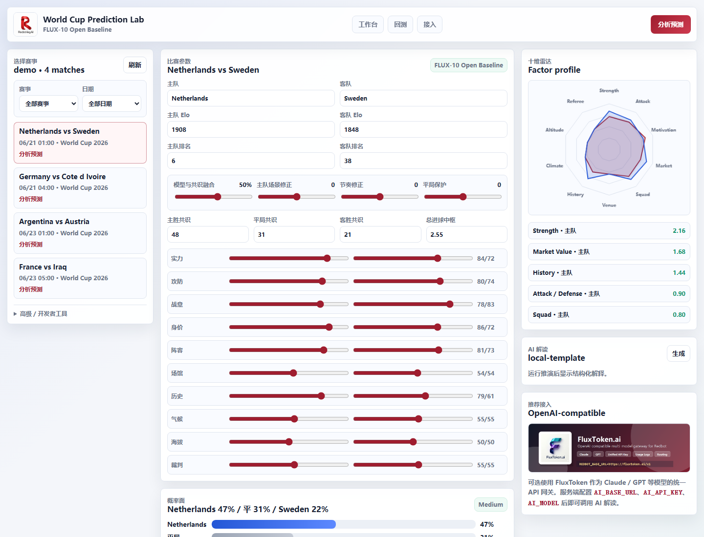

<div align="center">


# World Cup Prediction Lab

### 可解释的世界杯赛果推演工作台

[](LICENSE)
[](package.json)
[](https://github.com/RedStringAI/world-cup-prediction-lab/actions/workflows/ci.yml)
[](#ai-解读)

### 官方仓库：**[github.com/RedStringAI/world-cup-prediction-lab](https://github.com/RedStringAI/world-cup-prediction-lab)**

[English](README_EN.md) | 中文 | [日本語](README_JA.md) | [Deutsch](README_DE.md) | [FluxToken](https://fluxtoken.ai)

</div>

## 推荐的 OpenAI-compatible 多模型网关

[](https://fluxtoken.ai)

World Cup Prediction Lab 不绑定任何一家模型服务。AI 解读层只需要 OpenAI-compatible endpoint。如果你想在 Claude / GPT 等主流模型之间切换，可以使用 [FluxToken](https://fluxtoken.ai)。配置 `AI_BASE_URL=https://fluxtoken.ai/v1`、`AI_API_KEY` 和 `AI_MODEL` 后，本项目即可通过你的网关生成技术解读。

## 这是什么

World Cup Prediction Lab 是一个可本地运行的足球模型工作台。它把 FLUX-10 工作流中适合公开的部分整理成可复用产品：赛事菜单选择、十维量化、Elo 差、平局分档校准、双泊松比分矩阵、场景滑杆、回测指标、开发者 JSON 工具和可选 AI 解读。

它不是静态展示页。打开后普通用户先从赛事菜单点击需要分析的比赛，再运行预测、查看比分路径、调整场景参数，并用真实赛果计算 Brier / RPS / Top3 覆盖。JSON 导入导出保留在“高级 / 开发者工具”里，适合批量赛程、自动化脚本和二次开发。

## 预览



## 功能

- **可解释预测引擎**：输出胜/平/负概率、xG、比分矩阵、Top score paths、十维归因和风险旗标。
- **场景调参**：支持主队修正、节奏修正、平局保护、模型与公开共识融合比例。
- **可用前端工作台**：赛事菜单、赛事/日期筛选、点击分析预测、参数编辑、雷达图、比分热力图、卡片预览。
- **开发者工具**：JSON 导入导出被折叠到高级区域，方便批量赛程、测试和自动化接入。
- **回测面板**：输入实际比分后计算方向覆盖、Top3 覆盖、Brier Score 和 RPS。
- **OpenAI-compatible AI 解读**：可选接入 FluxToken、OpenAI、OpenRouter、自建 New API 或本地模型服务。
- **干净开源边界**：不包含私人原始素材、视频工作流、缓存、日志或密钥。

## 快速开始

```bash
npm install
npm start
```

打开：

```text
http://127.0.0.1:8798
```

运行测试：

```bash
npm test
```

## Codex Skill

仓库内置了可安装的 Codex skill：

```text
skills/world-cup-prediction
```

如果你使用 Codex，可以把该目录复制到本机技能目录：

```powershell
Copy-Item -Recurse skills/world-cup-prediction "$env:USERPROFILE\.codex\skills\world-cup-prediction"
```

之后在新对话里可以直接说：

```text
使用 world-cup-prediction skill，帮我分析菜单中选中的比赛；如果是自动化任务，再使用比赛 JSON 做推演和回测。
```

技能脚本也可以独立运行：

```bash
node skills/world-cup-prediction/scripts/forecast.cjs < match.json
node skills/world-cup-prediction/scripts/backtest.cjs < backtest.json
```

## AI 解读

复制 `.env.example` 为 `.env`，然后配置：

```bash
AI_BASE_URL=https://fluxtoken.ai/v1
AI_API_KEY=ft-your-key
AI_MODEL=gpt-4o-mini
```

AI 只负责把结构化模型输出解释成文字，不参与核心概率计算。没有 API Key 时，应用会自动使用本地模板解释。

## 开发者数据格式

普通用户不需要手写 JSON；页面默认通过赛事菜单选择比赛。高级 / 开发者工具中的 JSON 导入支持：

```json
{
  "fixtures": [
    {
      "id": "ned-swe-2026-06-21",
      "competition": "World Cup 2026",
      "kickoff": "2026-06-21T01:00:00+08:00",
      "home": { "name": "Netherlands", "elo": 1908, "fifaRank": 6, "factors": {} },
      "away": { "name": "Sweden", "elo": 1848, "fifaRank": 38, "factors": {} },
      "market": { "home": 0.48, "draw": 0.31, "away": 0.21, "totalGoals": 2.55 }
    }
  ]
}
```

完整字段可参考 [src/data/demo.cjs](src/data/demo.cjs)。

## 模型说明

详见 [docs/model.md](docs/model.md)。

核心流程：

1. 十维评分加权。
2. 结合 Elo 差生成基础概率面。
3. 应用平局分档底线。
4. 可选融合公开共识概率。
5. 推导 xG 并运行双泊松比分矩阵。
6. 输出回测可用指标和解释字段。

## 项目结构

```text
.
├── assets/
├── docs/
├── public/
├── src/
│   ├── data/
│   ├── model/
│   └── server/
├── tests/
├── server.js
└── package.json
```

## 免责声明

本项目用于体育数据分析研究和 AI 技术展示。模型推演仅供技术交流，不作现实依据。

## 许可证

MIT License，见 [LICENSE](LICENSE)。
